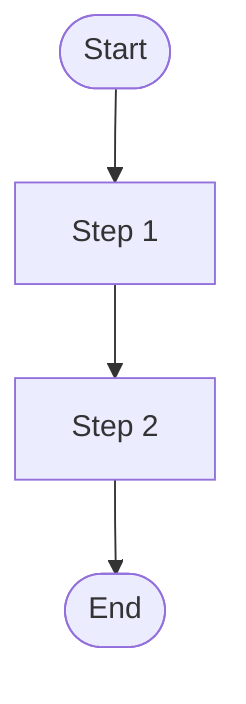
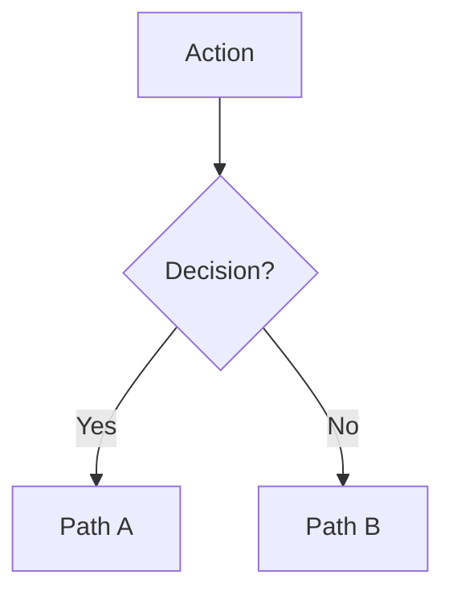
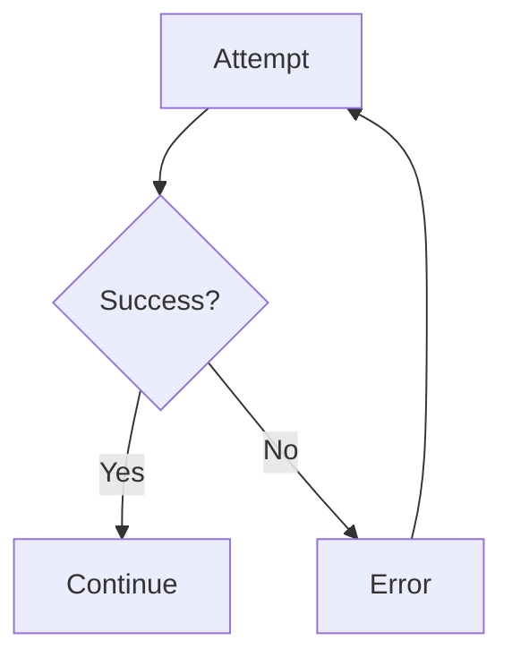

# Flow Patterns & Layout

## Shapes

Only five shapes. Anything more adds visual noise without helping comprehension.

| Shape | Construction | Fill | Meaning |
|---|---|---|---|
| **Start pill** | Rectangle, radius = 9999px | `SKY_50` (#009ECC) | Start of flow |
| **End pill** | Rectangle, radius = 9999px | `GRASS_50` (#67A300) | End of flow |
| **Rectangle** | Rectangle, radius = 6px | `WHITE` + NIGHT400 border | Screen, step, or action |
| **Decision rect** | Rectangle, radius = 8px | `SKY_5` + SKY_50 border | Decision point |
| **Error rect** | Rectangle, radius = 6px | `FIRE_5` + FIRE_50 border | Error state |

Connectors are vector lines (1.5px) with `ARROW_EQUILATERAL` stroke cap on the end vertex. Label every decision branch.

---

## Layout

**Top-to-bottom** for flows under 15 nodes. **Left-to-right** for wider flows or presentations.

Pick one direction and stick with it. Never mix.

**Sizing:**
- Node width: **200px** (ALL nodes — start, end, step, decision, error)
- Node height: **48px**
- Vertical gap between nodes: **72px** (includes space for connector + arrow)
- Horizontal gap between branch columns: **100px**
- Frame padding: **48px**
- Screenshot thumbnails: **200×125px** in a dedicated right column
- Screenshot connector: 1px dashed line from node right edge to thumbnail left edge

---

## Node Construction Pattern (CRITICAL — follow exactly)

Use this `buildNode()` helper for every flow node. Uses Loveship palette colors directly — no library binding.

**CRITICAL FIX: Lock node dimensions.** After setting `layoutMode = "HORIZONTAL"`, you MUST set `primaryAxisSizingMode = "FIXED"` and `counterAxisSizingMode = "FIXED"`. Without this, auto-layout HUGs text content, making nodes different widths. Arrows assume all nodes are exactly 200px wide — if nodes resize, arrows misalign.

```javascript
// Loveship palette — paste into every use_figma call
function h(hex) { return { r: parseInt(hex.slice(1,3),16)/255, g: parseInt(hex.slice(3,5),16)/255, b: parseInt(hex.slice(5,7),16)/255 }; }
var C = {
  WHITE: "#FFFFFF", NIGHT400: "#CED0DB", NIGHT600: "#6C6F80", NIGHT800: "#303240",
  SKY_5: "#F5FDFF", SKY_50: "#009ECC",
  FIRE_5: "#FEF6F6", FIRE_50: "#FF4242", FIRE_70: "#AD0000",
  GRASS_50: "#67A300",
};
function setFill(n, hex) { n.fills = [{ type: "SOLID", color: h(hex) }]; }
function setStroke(n, hex, w) { n.strokes = [{ type: "SOLID", color: h(hex) }]; n.strokeWeight = w || 1; }

var W = 200, H = 48;

// COMPLETE node builder — use for ALL flow nodes (PROVEN)
async function buildNode(root, label, x, y, type) {
  var node = figma.createFrame();
  node.name = label;
  node.resize(W, H);
  root.appendChild(node);
  node.x = x;
  node.y = y;

  // Auto-layout for centered text
  node.layoutMode = "HORIZONTAL";
  node.primaryAxisAlignItems = "CENTER";
  node.counterAxisAlignItems = "CENTER";
  node.paddingLeft = 12;
  node.paddingRight = 12;

  // *** CRITICAL: Lock dimensions so auto-layout doesn't resize the node ***
  node.primaryAxisSizingMode = "FIXED";
  node.counterAxisSizingMode = "FIXED";

  // Style by type — Loveship palette
  if (type === "start") {
    node.cornerRadius = 9999;
    setFill(node, C.SKY_50);   // Blue start pill
  } else if (type === "end") {
    node.cornerRadius = 9999;
    setFill(node, C.GRASS_50);  // Green end pill — differentiates from start
  } else if (type === "step") {
    node.cornerRadius = 6;
    setFill(node, C.WHITE);
    setStroke(node, C.NIGHT400, 1);
  } else if (type === "decision") {
    node.cornerRadius = 8;
    setFill(node, C.SKY_5);
    setStroke(node, C.SKY_50, 1.5);
  } else if (type === "error") {
    node.cornerRadius = 6;
    setFill(node, C.FIRE_5);
    setStroke(node, C.FIRE_50, 1.5);
  }

  // Text label — Inter font (always available in Figma)
  var t = figma.createText();
  var fw = (type === "start" || type === "end") ? "Semi Bold" : "Regular";
  await figma.loadFontAsync({ family: "Inter", style: fw });
  t.fontName = { family: "Inter", style: fw };
  t.characters = label;
  t.fontSize = 13;
  var tc = (type === "start" || type === "end") ? C.WHITE : (type === "error" ? C.FIRE_70 : C.NIGHT800);
  t.fills = [{ type: "SOLID", color: h(tc) }];
  t.textAlignHorizontal = "CENTER";
  t.textTruncation = "ENDING";
  node.appendChild(t);
  t.layoutSizingHorizontal = "FILL";

  return node;
}
```

### Why `primaryAxisSizingMode = "FIXED"` matters

Without this line, here's what happens:
1. You create a 200×48 frame with HORIZONTAL auto-layout
2. Auto-layout defaults to `primaryAxisSizingMode = "AUTO"` (HUG content)
3. You add text "Continue or Checkout?" — wider than 200px with padding
4. The frame expands to ~230px to fit the text
5. Arrow at `COL + 100` (assuming 200/2 center) no longer hits the node center
6. **Result: arrows misalign with wider nodes**

With `"FIXED"`, the frame stays at exactly 200px. Text truncates with "…" if too long.

---

## Connector Construction

Use `createVector()` with `vectorNetwork` to build lines with `ARROW_EQUILATERAL` stroke cap on the end vertex. This creates a single clean arrow.

**IMPORTANT**: Use `createVector()`, NOT `createLine()`. Only `VectorNode` supports `vectorNetwork` for per-vertex stroke caps.

### Generic Arrow (any direction — NORMALIZED)

**CRITICAL:** This version handles ALL directions (right, left, down, up, diagonal) by normalizing coordinates. The old version (`vec.x = x1`) broke for leftward/upward arrows because Figma vectors need non-negative local coordinates.

```javascript
function drawArrow(root, x1, y1, x2, y2) {
  var vec = figma.createVector();
  var ox = Math.min(x1, x2);
  var oy = Math.min(y1, y2);
  vec.vectorNetwork = {
    vertices: [
      { x: x1 - ox, y: y1 - oy, strokeCap: "NONE" },
      { x: x2 - ox, y: y2 - oy, strokeCap: "ARROW_EQUILATERAL" }
    ],
    segments: [{ start: 0, end: 1, tangentStart: { x: 0, y: 0 }, tangentEnd: { x: 0, y: 0 } }],
    regions: []
  };
  vec.x = ox; vec.y = oy;
  setStroke(vec, C.NIGHT400, 1.5);
  vec.fills = [];
  root.appendChild(vec);
  return vec;
}
```

**Why `Math.min`?** Figma vectors are positioned at their top-left corner. Local coordinates in `vectorNetwork` must be relative to that corner (non-negative). For a leftward arrow from (500,100) to (300,100): `ox=300, oy=100`, vertex 0 at (200,0), vertex 1 at (0,0). The vector is placed at (300,100) with width=200.
```

### Vertical connector (node bottom → next node top) — CRITICAL

**COMMON BUG: Arrow too short, leaving a gap before the next node.** This happens when you subtract H from the gap distance. The arrow must span the FULL distance from node bottom to next node top.

```javascript
// CORRECT pattern — arrow reaches the next node:
cy += H;                    // cy = current node bottom
drawArrow(root, COL + W/2, cy, COL + W/2, cy + VGAP);  // arrow spans full VGAP
cy += VGAP;                 // cy = next node top position
// Place next node at (COL, cy)

// WRONG pattern — arrow is H pixels too short, leaves a gap:
// drawArrow(root, COL+W/2, cy, COL+W/2, cy+VGAP-H);  // ← BUG: -H makes arrow 48px too short
```

### Horizontal RIGHT connector (decision → right branch)

```javascript
// From decision node RIGHT edge to branch node LEFT edge:
// Decision at (COL, decisionY), branch at (branchX, branchY)
drawArrow(root, COL + W, decisionY + H/2, branchX, branchY + H/2);
// Label goes just after decision right edge
branchLabel(root, "Label", COL + W + 8, decisionY + H/2 - 16);
```

### Horizontal LEFT connector (decision → left branch) — CRITICAL FIX

**LEFT branches require reversed coordinates.** The arrow must go from decision LEFT edge LEFTWARD to the branch node RIGHT edge. Do NOT simply negate — use absolute coordinates:

```javascript
// From decision LEFT edge to left-branch RIGHT edge:
// Decision at (COL, decisionY), left branch at (leftBranchX, decisionY)
drawArrow(root, leftBranchX + W, decisionY + H/2, COL, decisionY + H/2);
// Label goes between the two nodes
branchLabel(root, "Label", leftBranchX + W + 8, decisionY + H/2 - 16);
```

**Why this works:** `drawArrow(x1,y1,x2,y2)` draws from (x1,y1) to (x2,y2) with the arrowhead at (x2,y2). For a left branch, the arrowhead should point at the left branch node, so (x1,y1) = decision left edge, (x2,y2) = branch right edge. But actually the arrow semantically "goes from decision to branch," so the arrowhead should be on the branch side. Use `drawArrow(root, COL, decisionY+H/2, leftBranchX+W, decisionY+H/2)` — arrowhead points at left branch.

**IMPORTANT:** When x2 < x1 (leftward arrow), the `vectorNetwork` local coordinates will have a negative X delta. Figma handles this correctly — the vector's bounding box will have x = min(x1,x2) and width = abs(x2-x1). The code must set `vec.x = Math.min(x1, x2)` and use relative coordinates in the vectorNetwork:

```javascript
function drawArrow(root, x1, y1, x2, y2) {
  var vec = figma.createVector();
  var ox = Math.min(x1, x2);
  var oy = Math.min(y1, y2);
  vec.vectorNetwork = {
    vertices: [
      { x: x1 - ox, y: y1 - oy, strokeCap: "NONE" },
      { x: x2 - ox, y: y2 - oy, strokeCap: "ARROW_EQUILATERAL" }
    ],
    segments: [{ start: 0, end: 1, tangentStart: { x: 0, y: 0 }, tangentEnd: { x: 0, y: 0 } }],
    regions: []
  };
  vec.x = ox; vec.y = oy;
  setStroke(vec, C.NIGHT400, 1.5);
  vec.fills = [];
  root.appendChild(vec);
  return vec;
}
```

This updated `drawArrow()` handles ALL directions (right, left, down, up) correctly by normalizing coordinates.

### Multiple horizontal branches from one decision (CRITICAL — don't chain)

When a decision has multiple horizontal alternatives (e.g., Auth Method → Google, Apple, Phone), do NOT chain them sequentially. Each branch gets its own arrow from the decision node, and branches are stacked vertically:

```
  [Auth Method?] ──→ [Google OAuth]      ← Row 1 at decisionY
        |
        └──────────→ [Apple OAuth]       ← Row 2 at decisionY + H + 30
        |
      [Phone path continues down]
```

```javascript
// Multiple RIGHT branches from one decision:
var branchX = COL + W + HGAP;  // same X for all branches
var branchY1 = decisionY;       // first branch at same Y as decision
var branchY2 = decisionY + H + 30; // second branch below

buildNode(root, "Google OAuth", branchX, branchY1, "step");
drawArrow(root, COL + W, decisionY + H/2, branchX, branchY1 + H/2);
branchLabel(root, "Google", COL + W + 8, branchY1 + H/2 - 16);

buildNode(root, "Apple OAuth", branchX, branchY2, "step");
drawArrow(root, COL + W, decisionY + H/2, branchX, branchY2 + H/2);
branchLabel(root, "Apple", COL + W + 8, branchY2 + H/2 - 16);
```

### Feedback loop connector (error → back to earlier step) — CRITICAL

When a node (e.g., "Show Error Messages") needs to loop back to an earlier node (e.g., "Enter Recipient Info"), use an L-shaped routing path that goes AROUND the flow, not through it:

```
  [Enter Recipient Info] ←──────────────────┐
        |                                    |
  [Validation Passes?] ──No──→ [Show Error] ─┘
        |
      Yes
```

The feedback connector has 3 segments: (1) right from error, (2) up to target Y, (3) left back to target:

```javascript
function drawFeedbackLoop(root, sourceNode, targetNode) {
  // Route: source right edge → right margin → up to target Y → left to target right edge
  var sx = sourceNode.x + W;           // source right edge
  var sy = sourceNode.y + H/2;         // source center Y
  var tx = targetNode.x + W;           // target right edge
  var ty = targetNode.y + H/2;         // target center Y
  var margin = 40;                      // how far right to route

  var vec = figma.createVector();
  var ox = tx;
  var oy = ty;
  vec.vectorNetwork = {
    vertices: [
      { x: sx - ox + margin, y: sy - oy, strokeCap: "NONE", cornerRadius: 12 },  // start: right of source
      { x: sx - ox + margin, y: 0, strokeCap: "NONE", cornerRadius: 12 },          // turn: up to target Y
      { x: 0, y: 0, strokeCap: "ARROW_EQUILATERAL" }                               // end: target right edge
    ],
    segments: [
      { start: 0, end: 1 },
      { start: 1, end: 2 }
    ],
    regions: []
  };
  vec.x = ox; vec.y = oy;
  setStroke(vec, C.NIGHT400, 1.5);
  vec.fills = [];
  root.appendChild(vec);
  return vec;
}
```

### Branch Label (PROVEN)

```javascript
async function lbl(root, text, x, y) {
  var t = figma.createText();
  await figma.loadFontAsync({ family: "Inter", style: "Semi Bold" });
  t.fontName = { family: "Inter", style: "Semi Bold" };
  t.fontSize = 11;
  t.characters = text;
  t.fills = [{ type: "SOLID", color: h(C.NIGHT600) }];
  root.appendChild(t);
  t.x = x; t.y = y;
  return t;
}
```

**Label positioning convention:**
- Right branch labels: `lbl(root, "Label", COL + W + 8, branchY + H/2 - 16)`
- Left branch labels: `lbl(root, "Label", leftX + W + 8, branchY + H/2 - 16)`
- Vertical spine labels: `lbl(root, "Label", COL + W/2 + 8, arrowStartY + 6)`

---

## Branch Layout

When a decision node has 2-3 branches:

1. Place the decision node centered in the main column
2. Main path continues **downward** with a vertical arrow + label
3. **Single side branch**: horizontal arrow left OR right to one alternative node
4. **Multiple side branches**: stack alternatives vertically (each at decisionY + n*(H+30)), each with its own arrow from the decision
5. **Feedback loops**: use L-shaped routing (right → up → left) to connect back to earlier nodes
6. Add branch labels near each arrow ("Yes", "No", "Google", etc.)

```
                  [Decision?]
                       |
           [Left]  ←---+---→  [Right 1]
                       |
                       +------→  [Right 2]
                       |
                     [Down]
```

Column positions for branches (W=200, HGAP=100):
- Left branch: `x = COL - W - HGAP`
- Main column: `x = COL`
- Right branch: `x = COL + W + HGAP`
- Second right branch: same x, `y = decisionY + H + 30`

### Skip-path bypass (decision → skip multiple spine nodes) — PROVEN

When a decision's "Yes" path should skip several spine nodes (e.g., "Signed In? Yes" skips auth and goes directly to Review Form), use a 3-segment right bypass:

```
  [Signed In?] ──Yes──→ ┐
       |                 │  (right bypass corridor)
      No                 │
       |                 │
  [Auth Method?]         │
       |                 │
  [Review Form] ←────────┘
```

```javascript
// Skip-path: decision right edge → right corridor → down → left back to target
var bypassX = COL + W + HGAP; // right corridor X
drawArrow(root, COL + W, decisionY + H/2, bypassX, decisionY + H/2);  // right
drawArrow(root, bypassX, decisionY + H/2, bypassX, targetY + H/2);     // down
drawArrow(root, bypassX, targetY + H/2, COL + W, targetY + H/2);       // left into target
lbl(root, "Yes (skip auth)", COL + W + 8, decisionY + H/2 - 16);
```

This creates a visible right-side corridor that clearly shows the skip path. The main spine continues downward through the skipped nodes.

**CRITICAL RULES FOR HORIZONTAL ARROWS:**
1. **Always use the normalized `drawArrow()` that handles all directions** (uses `Math.min` for position).
2. **Never chain horizontal nodes.** If Auth Method has Google AND Apple branches, each gets its own arrow from Auth Method — NOT Auth → Google → Apple.
3. **For left branches**, arrowhead points at the left node: `drawArrow(root, COL, midY, leftX+W, midY)`.
4. **For feedback loops**, use `drawFeedbackLoop()` — never draw a straight line backward through other nodes.
5. **For skip-paths**, use a 3-segment right bypass (right → down → left) that visually routes around the skipped nodes.

---

## Screenshot Placement

Screenshots go in a **dedicated column** to the right of the entire flow diagram. NOT inline between nodes.

```
[Flow nodes]  |  gap  |  [Screenshots column]
              |  60px |
```

- Screenshot column x: `rightmost_flow_column + W + 60`
- Each screenshot: 200×125px, with 4px corner radius, 1px subtle border
- Vertical position: align each screenshot's vertical center with its corresponding flow node
- Draw a 1px dashed line from the flow node's right edge to the screenshot's left edge

---

## Rules

1. Every node must connect to something (no orphans)
2. No crossed arrows — rearrange nodes to avoid
3. Max 3 branches per decision — split into sequential decisions if more
4. Show error paths — every action that can fail needs a failure branch
5. **All nodes same width (200px)** — locked with `primaryAxisSizingMode = "FIXED"`
6. **All connectors centered on node midpoint** — vertical at `node.x + W/2`, horizontal at `node.y + H/2`
7. Arrow uses `ARROW_EQUILATERAL` stroke cap on end vertex via `vectorNetwork`
8. Use Loveship palette colors — `setFill()` / `setStroke()` directly, no library binding
9. **Font: Inter** — always available in Figma, no fallback needed. Use "Semi Bold" (with space) not "SemiBold".
10. **Start pill = SKY_50 (blue), End pill = GRASS_50 (green)** — visually distinct start vs end
11. **Use normalized `drawArrow()`** with `Math.min` for ALL directions (Rule #57)
12. **Never chain horizontal branches** — stack vertically with separate arrows (Rule #58)
13. **Feedback loops use L-shaped routing** — right → up → left (Rule #59)
14. **Skip-paths use 3-segment right bypass** — right → down → left (Rule #60)

## Proven Build Order (2 calls total)

**Call 1: Main spine + vertical connectors (~10-12 nodes)**
- Create root frame (white, clipsContent=false)
- Title + subtitle
- All main-path nodes top-to-bottom using `buildNode()`
- Vertical `drawArrow()` between each pair
- Branch labels on spine arrows ("Yes", "No", etc.)
- Return root ID + decision Y positions

**Call 2: All branches + feedback loops + resize**
- Reference root via `await figma.getNodeByIdAsync(rootId)`
- LEFT branches: `drawArrow(root, COL, midY, leftX+W, midY)`
- RIGHT branches: `drawArrow(root, COL+W, midY, branchX, branchY+H/2)`
- Stacked branches: each at `decisionY + n*(H+20)`
- Skip-paths: 3-segment right bypass
- Feedback loops: L-shaped `drawFeedbackLoop()`
- Resize root to fit all content
- Return total node count

**This 2-call pattern is PROVEN** across multiple real-world flows (16-17 nodes, 4-5 decisions). It replaces the old "max 10 nodes per call" guidance.

---

## Mermaid Patterns

For `generate_diagram` (FigJam output):

**Linear flow:**


**Decision:**


**Retry loop:**

